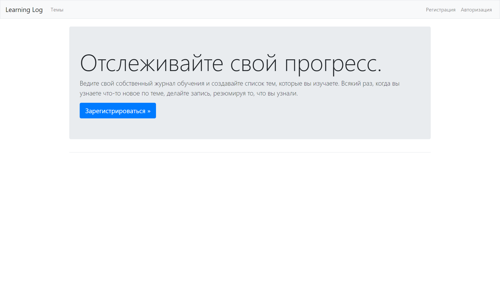

# Learning Log

---
В данном репозитории представлена реализация проекта Learning Log из книги Python Crash Course Эрика Мэтиза. 

Learning Log - это веб-приложение, которое позволяет пользователям создавать собственные темы для изучения и записывать 
свой прогресс в изучении каждой темы. Пользователи могут добавлять записи и просматривать свой прогресс в любое время. 
Это приложение идеально подходит для людей, которые хотят организовать изучение новых тем или навыков.
---


## Начало работы
Эти инструкции помогут вам скопировать проект на свою локальную машину для разработки и тестирования.

## Установка
1. Клонируйте репозиторий:
```
git clone https://github.com/Sogato/DataVisualization.git
```
2. Создайте и активируйте виртуальное окружение:
```
python -m venv env
source env/bin/activate # Linux/MacOS
env\Scripts\activate # Windows
```
3. Установите зависимости проекта:
```
pip install -r requirements.txt
```
4. Выполните миграции:
```
python manage.py migrate
```
5. Создайте суперпользователя:
```
python manage.py createsuperuser
```
6. Запустите сервер разработки:
```
python manage.py runserver
```
7. Откройте приложение в веб-браузере: http://localhost:8000/

## Построено с использованием
* Django - Используемый веб-фреймворк
* Bootstrap - Используемый CSS фреймворк
